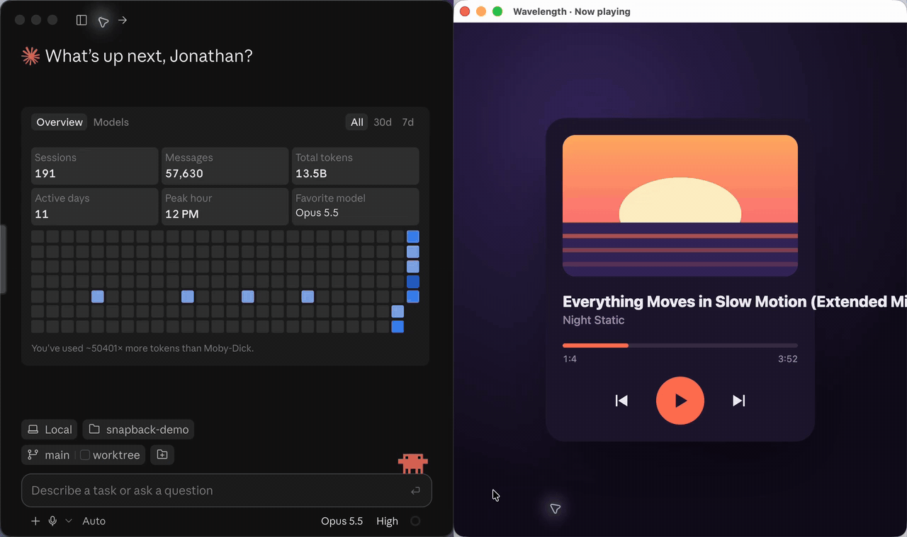

# Snapback: screenshot annotation for Claude Code

Point at what's wrong, say why, send it to Claude.



Snapback is a macOS menu bar app for giving visual feedback to Claude Code. Press a shortcut and it captures the front window; click to drop numbered pins or drag to draw boxes, and write a note for each. Sending it opens a new Claude Code chat and pastes one image: the screenshot with its markers, and the numbered notes underneath.

## Install

Download the latest `Snapback-x.y.z.dmg` from [Releases](https://github.com/jonathan-oralart/snapback/releases/latest), open it and drag Snapback to Applications. It updates itself.

Requires macOS 26.4 and the [Claude desktop app](https://claude.ai/download). On first launch Snapback asks for:

- **Screen Recording**, to capture the front window or record the screen.
- **Accessibility**, to paste the screenshot into Claude.

## Use

| | |
| --- | --- |
| Capture the front window | ⌃⌥⌘C (change it in Settings) |
| Record the screen / stop | ⌃⌥⌘R (change it in Settings) |
| Drop a pin / draw a box | Click / drag |
| Move or resize | Drag a marker, or a box's corner handles |
| Marker size | − and + |
| Delete a marker | Select it, then ⌫ |
| Older / newer capture | ← → |
| Send to Claude | ⌘↩ |
| Copy the annotated image | ⌘C |
| Close and save | Esc, or click outside the screenshot |
| Close without saving | ⌘⌫ |

For states that only last while you hold a key or the mouse, record instead: press ⌃⌥⌘R, do it, then stop with ⌃⌥⌘R or the floating stop button. The recording opens with a timeline; drag along it or step with ← →, and keep up to six frames with Space (adding a marker keeps its frame too). Crop narrows every frame to the part that matters. Kept frames are sent as one image, in a grid, with markers numbered across them.

The last 20 captures are kept under **Recent** in the menu bar icon, recordings with their video.

The send and copy sound (pick one or turn it off in Settings) is from [SND](https://snd.dev)'s SND01 "sine" kit by Yasuhiro Tsuchiya.

## Build

Needs Xcode 26 and [XcodeGen](https://github.com/yonaskolb/XcodeGen).

```sh
xcodegen generate
open Snapback.xcodeproj
```

Set your own team in `project.yml` (`DEVELOPMENT_TEAM`) to sign it.

`scripts/dev.sh` builds, installs and relaunches a separate **Snapback Dev** app, so a development copy keeps its own permissions and settings next to a release install.

## Releasing

One-time setup:

1. A paid Apple Developer account; Xcode creates the Developer ID certificate when exporting.
2. Store notarization credentials (use an [app-specific password](https://account.apple.com)):
   ```sh
   xcrun notarytool store-credentials snapback --apple-id <you@example.com> --team-id <TEAMID>
   ```
3. The Sparkle signing key lives in the login keychain. Back it up with `generate_keys -x <file>` (from Sparkle's `bin` folder); without it, existing installs can't verify updates.

Then commit and run:

```sh
scripts/release.sh 1.0.0
```

This builds, signs, notarizes, writes the Sparkle `appcast.xml` and publishes both to a GitHub Release. Installed copies pick it up from `releases/latest/download/appcast.xml`.
